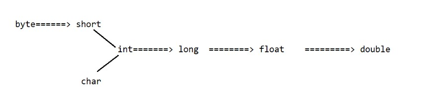

# Polymorphism in Java

## Definition
- Polymorphism means many forms
- One thing taking multiple forms
- Java supports 2 types of polymorphism
  - Compile time polymorphism (Method overloading)
  - Run time polymorphism (Method overriding)

---

## Compile time polymorphism (Method overloading)
- Two methods are said to be overloaded methods if and only if the method names are same, but they change only with argument type.
- Benefit from overloading is, it reduces the burden on the programmer in remembering multiple method names.
- In method overloading, Java Compiler will automatically bind the method calls based on reference type (not on the object). Since binding of call is happening at the compile time we say Method Overloading is Compile time polymorphism

**Example**
```java
public class Demo {
    public void methodOne() {
        System.out.println("Zero arg method");
    }

    public void methodOne(int a) {
        System.out.println("int arg method");
    }

    public void methodOne(double d) {
        System.out.println("double arg method");
    }

    public static void main(String[] args) {
        Demo d = new Demo();
        d.methodOne();
        d.methodOne(10);
        d.methodOne(10.5);
    }
}

// Output
Zero arg method
int arg method
double arg method
```

---

## Automatic Type Promotion (Implicit Type Casting)


- In method overloading, if the compiler is not able to find the exact method, instead of throwing error, it will try to promote the data to the nearest type and check for match, it will continue this process until it finds a match, if none found only then it will throw error.

```java
methodOne(int a) {}
methodOne(float d) {}

demo.method('c'); // int arg method
demo.method(25L); // float arg method

// --------------------------------------

methodOne(int x, float y) {}
methodOne(float x, int y) {}

demo.methodOne(10, 22.5); // int, float arg method
demo.methodOne(22.5, 10); // float, int arg method
demo.methodOne(10, 10); // CE: Ambiguous method call
demo.methodOne(22.5, 22.5); // CE: Unable to find method
```

---

- In method overloading, when the compiler needs to resolve method call involving types like String, StringBuilder, StringBuffer, and Object, it first attempts to find an exact match. If not available, it then tries to bind the call to child type. If that is not available, then compiler will throw an error.

```java
greet(String s) {}
greet(Object o) {}

student.greet("sachin"); // String arg method
student.greet(new Object()); // Object arg method
student.greet(null); // string arg method

// --------------------------------------

study(String s) {}
study(StringBuilder sb) {}

student.study("john"); // String arg method
student.study(new StringBuilder("john")); // StringBuilder arg method
student.study(null); // Compile Time Error: Ambiguous method call

// --------------------------------------

public class Demo {
    public void eat(Animal a) { }
    public void eat(Dog d) {}

    public static void main(String[] args) {
        Demo demo = new Demo();

        Animal a1 = new Animal();
        demo.eat(a1); // Animal arg method

        Dog d1 = new Dog();
        demo.eat(d1); // Dog arg method

        Animal a2 = new Dog();
        demo.eat(a2); // Animal arg method
    }

}
```

---

- In method overloading, when the compiler needs to resolve method call it gives 1st preference to primitive types, 2nd preference to type promotion, 3rd preference to Wrapper classes.
```java
methodOne(Short i) {}
methodOne(Integer i) {}
methodOne(int i) {}

short s = 35;
Integer i = 45;
demo.methodOne(s); // int arg method
demo.methodOne(i); // Integer arg method
```

---

## Run time polymorphism (Method overriding)

- Methods in Parent class will be inherited by the Child class by default. 
- If the child class is not satisfied with the inherited methods, child class is allowed to change the implementation
- This is achieved by @Override annotation.
- Parent class method will be called `overriden` method
- Child class method will be called `overriding` method
- In method overriding, `JVM` will perform the method binding based on the runtime object.
- In method overriding, `Compiler` will not perform the method binding, instead it will only check the method is available in the reference object.

```java
class Parent {
    public void assets() { 
        System.out.println("Gold, Silver, Land, House"); 
    }

    public void marry() { 
        System.out.println("Marry only relative girl"); 
    }
}

class Child extends Parent {
    @Override
    public void marry() { 
        System.out.println("I will marry Samantha"); 
    }
}

public class Demo {
    public static void main(String[] args) {
        Parent p = new Parent();
        p.assets(); // Gold, Silver, Land, House
        p.marry(); // Marry only relative girl

        Child c = new Child();
        c.assets(); // Gold, Silver, Land, House
        c.marry(); // I will marry Samantha

        Parent p1 = new Child();
        p1.assets(); // Gold, Silver, Land, House
        p1.marry(); // I will marry Samantha
    }
}
```

---

```java
class Parent {
    public void m1(int x) {}

    public void m2(float f) {}
}

class Child extends Parent {
    @Override
    public void m1(int x) {} // overriding method
     
    public void m3(double d) {} // specialized method

    @Override
    public void m4(long l) {} // Compile Time Error
}
```

---

## Rules of Method Overriding

- Method name & argument must be exactly same in Parent & Child
- Until JDK 1.4, return type was also supposed to be same.
- From JDK 1.5, return types can be changed in the child class, provided the return types has a relationship.

```java
class Parent {
    public Object methodOne(int x) {
        return null;
    }

    public Number methodTwo(int x) {
        return null;
    }
}

class Child extends Parent {
    @Override
    public String methodOne(int x) {
        return "hello"; // return type can be changed to String, since String is a child class of Object
    }

    @Override
    public Integer methodTwo(int x) {
        return 25; // return type can be changed to Integer, since Integer is a child class of Number
    }
}
```

## `Private` methods in overriding
- Private methods cannot be overridden. 
- Private methods do not participate in Inheritance.
- Child class can write same method again, no need to override, since this will be specialized method.

```java
class Parent {
    private void m1() {}
}

class Child extends Parent {
    @Override
    private void m1() {} // Compile Time Error

    private void m1() {} // specialized method
}
```

---

## `final` keyword in overriding

- final methods cannot be overridden.

```java
class Parent {
    public final void m1() {}
}

class Child extends Parent {
    @Override
    public void m1() {} // Compile Time Error
}
```

---

## `Access modifiers` in overriding

- Increasing visibility is permitted in overriding.
- Decreasing visibility is not permitted in overriding

```java
class Parent {
    public void m1() {}

    protected void m2() {}

    private void m3() {}
}

class Child extends Parent {
    @Override
    protected void m1() {} // Compile Time Error

    @Override
    public void m2() {} // Compilation successful
}
```

---

## `static` methods in overriding

- `static` methods cannot be overridden.
- Because `static` methods belong to the class and Polymorphism is a concept on objects, not classes.
- Method binding for `static` methods are done at compile time, by the compiler.

```java
class Parent {
    public static void m1() {}
}

class Child extends Parent {
    @Override
    public static void m1() {} // Compile Time Error
}
```

---

```java
class Parent {
    public static void m1() { 
        System.out.println("Parent static method"); 
    }
}

class Child extends Parent {
    public static void m1() {
        System.out.println("Child static method");
    }
}

public class Demo {
    public static void main(String[] args) {
        Parent p = new Parent();
        p.m1(); // Parent static method

        Child c = new Child();
        c.m1(); // Child static method

        Parent p1 = new Child();
        p1.m1(); // Parent static method, This is called Method Hiding
    }
}
```

---

## Thumb rule

### Method Overloading (Same class)
- Method `name` must be `same`
- Method `arguments` must be `different`

### Method Overriding (Parent & Child class)
- Method `name` must be `same`
- Method `arguments` must be `same`

### Method Hiding (Parent & Child class)
- Method `name` must be `same` & `static`
- Method `arguments` must be `same`

---