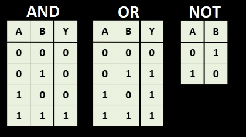

# Operators in Java

## Arithmetic operators
- Allows to perform mathematical calculations on variables.
- Available arithmetic operators:
  - Addition `(+)`
  - Substraction `(-)`
  - Multiplication `(*)`
  - Division `(/)`
  - Modulus `(%)`

**Example**

```
public class ArithmeticExample {
    public static void main(String[] args) {
        int a = 10;
        int b = 3;

        System.out.println("Addition: " + (a + b));       // 13
        System.out.println("Subtraction: " + (a - b));    // 7
        System.out.println("Multiplication: " + (a * b)); // 30
        System.out.println("Division: " + (a / b));       // 3
        System.out.println("Modulus: " + (a % b));        // 1
    }
}
```

### Long Division Representation of `/` and `%`
```
20 / 5 = 4
20 % 5 = 0

        4 (Quotient - output of division)
    --------
5  |   20
       20
    --------
        0 (Remainder - output of modulus)
```

---

## Relational Operators
- They are used to compare two values or variables.
- They evaluate a condition & return a boolean result.
  - Available relational operators:
    - Equal to `==`
    - Not equal to `!=`
    - Greater than `>`
    - Less than `<`
    - Greater than or equal to `>=`
    - Less than or equal to `<=`

**Example**
```
public class RelationalExample {
    public static void main(String[] args) {

        int a = 10;
        int b = 5;

        System.out.println(a == b);  // false
        System.out.println(a != b);  // true
        System.out.println(a > b);   // true
        System.out.println(a < b);   // false
        System.out.println(a >= b);  // true
        System.out.println(a <= b);  // false
    }
}
```

---

## Logical Operators
-  Used to combine boolean expressions.
-  They evaluate multiple conditions and return a boolean result.
-  Available logical operators:
    - Logical AND - `&&` - True if both conditions are true.
    - Logical OR - `||` - True if at least one condition is true.
    - Logical NOT - `!` - Reverses the boolean value.

**Example**
```
public class LogicalOperatorExample {
    public static void main(String[] args) {

        int studentAge = 25;

        // Logical AND
        if (studentAge >= 18 && studentAge <= 25) {
            System.out.println("Eligible for scholarship");
        }

        // Logical OR
        if (studentAge < 18 || studentAge > 25) {
            System.out.println("Not eligible for scholarship");
        }
    }
}
```

### Logical Operators Table



---

## Assignment Operators
-  Used to assign values to variables.
-  Basic assignment operator `=`
-  Java also provides compound assignment operators
   -  `+=` which means `x = x + value`
   -  `-=` which means `x = x - value`
   -  `*=` which means `x = x * value`
   -  `/=` which means `x = x / value`
   -  `%=` which means `x = x % value`

**Example**
```
public class AssignmentOperatorExample {
    public static void main(String[] args) {

        int x = 10;

        x += 5;  // x = x + 5 → 15
        x -= 3;  // x = x - 3 → 12
        x *= 2;  // x = x * 2 → 24
        x /= 4;  // x = x / 4 → 6
        x %= 5;  // x = x % 5 → 1

        System.out.println(x);
    }
}
```

---

## Increment and Decrement Operators
- These are unary operators used to increment/decrement the value of a variable by 1.
- They are commonly used in loops & iterative logics.
- They can be used as prefix/postfix.
  - `++x` -> increment first, then use value
  - `x++` -> use value first, then increment
  - `--x` -> decrement first, then use value
  - `x--` -> use value first, then decrement

**Example**

```
public class IncrementDecrementExample {
    public static void main(String[] args) {
        int a = 5;

        System.out.println(a++); // print 5, then a becomes 6
        System.out.println(++a); // increment first → 7, then print 7
    }
}
```

---